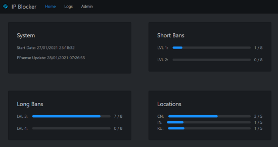
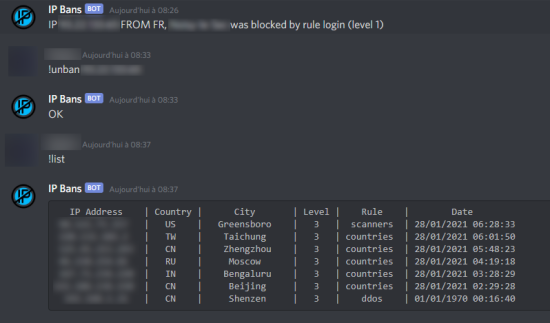

# IP Blocker for Graylog and PFsense

Software to block IPs on pfsense firewall (via [FauxAPI](https://github.com/ndejong/pfsense_fauxap)) based on a gelf stream

## Installation
 - Import db.sql in your database system (Maria DB recommanded)
 - Customize your config.json file and edit its path in the docker-compose.yml file
 - Clone this repo and run `docker-compose build` to build the container and `docker-compose up -d` to start it

## Configuration
### <ins>IP Blocker</ins>:
|Name | Description |
|--------|------------|
| db_host | Database Host |
| db_user | Database User |
| db_password | Database Password |
| db_name | Database Name |
| gelf_bind_addr | Gelf listener bind address |
| gelf_port | Gelf listener port |
| fauxapi_host | PFsense IP |
| fauxapi_apikey | PFsense FauxAPI key |
| fauxapi_apisecret | PFsense FauxAPI secret |
| fauxapi_alias_name | PFsense Alias Table Name |
| enable_ban_notif | Enable discord notification for each ip ban |
| bot_token | discord bot token (leave empty to disable the bot) |
| bot_channel | discord channel id to send notifications (in discord with dev mode, right click on the channel -> Copy Identifier) |
| check_interval | Check interval for ban processing (level 1 and 2), in seconds |
| level_x_detect_time | detection time for level 1 bans (in seconds) |
| level_x_detect_nb | detection time for level 1 bans (in seconds) |
| level_x_ban_time | duration of a ban (in seconds) |
| level_2_detect_nb_lvl1 | number of level 1 messages to get an equivalent level 2 |

There a 4 levels of ban:
 - level 1 and 2 are triggered when there was a specified number of messages (level_x_detect_nb) in a specified period of time (level_x_detect_time)
 - level 3 is instantly banned
 - level 4 is instantly and permantently banned
For levels 1 to 3 you can specify a ban time duration (level_x_ban_time)

### <ins>Graylog</ins>:
Create an output stream (GELF UDP) pointing to your IP Blocker ip/port  
The following fields are processed:  
 - IPV4: an IPv4 address (required)
 - threat_level: the level of the threat (from 1 to 4)  (required)
 - threat_rule: the name of the rule that triggered the ban (optional)
 - src_ip_geo_country: the country associated to the IP (optional)
 - src_ip_geo_city: the city associated to the IP (optional)
 - fields: json that can contains the previous fields (optional)

### <ins>PFsense</ins>:
[Install FauxAPI](https://github.com/ndejong/pfsense_fauxapi#installation)  
Edit the /etc/fauxapi/credentials.ini file and [create a user](https://github.com/ndejong/pfsense_fauxapi#api-authentication)  
Give this user the following permissions: `permit = config_get, config_set, send_event`   
Create an IP Alias of Host Type  

## Screenshots

